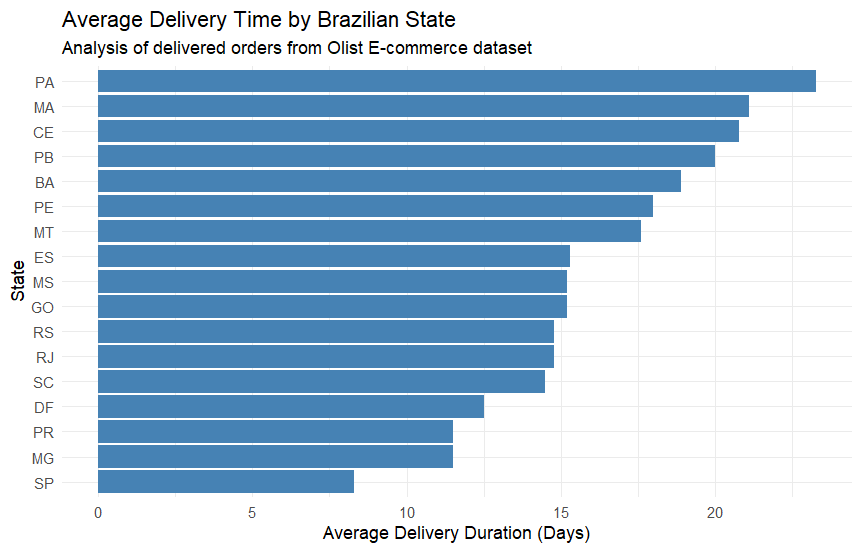

# Brazilian E-Commerce (Olist) Relational Data Analysis
**SQL & R Exploratory Data Analysis Pipeline**

## Executive Summary
This project analyzes ~100k anonymized e-commerce orders from the Brazilian Olist dataset (2016–2018). Using **PostgreSQL** for relational schema design and data extraction, alongside **R (ggplot2)** for data visualization, this analysis evaluates category sales trends, regional revenue concentration, and logistics delivery performance across Brazilian states.

---

## Technical Stack & Architecture
* **Database Engine:** PostgreSQL (DBeaver IDE)
* **Programming / Analytics:** R (RStudio)
* **Core Libraries:** `DBI`, `RPostgres`, `tidyverse` (`dplyr`, `ggplot2`)
* **Relational Schema:** 5 normalized tables connected via foreign key constraints (`customers`, `products`, `orders`, `order_items`, `order_payments`)

---

## Key Analytical Findings

1. **Revenue Concentration:** Sales volume is heavily concentrated in southeastern states (notably São Paulo - `SP` and Rio de Janeiro - `RJ`), following a classic 80/20 Pareto distribution.
2. **Logistics Bottlenecks:** Delivery times exhibit extreme geographic variance. Northern/Amazonian states (e.g., Roraima - `RR`, Amapá - `AP`, Amazonas - `AM`) average 26–29 delivery days, compared to under 12 days for central metropolitan hubs.
3. **Product Performance:** Top-performing product categories by revenue include Health & Beauty (`beleza_saude`), Watches/Gifts (`relogios_presentes`), and Bed/Bath/Table (`cama_mesa_banho`).

---

## Data Visualization
Below is the horizontal bar plot generated via `ggplot2` connecting directly to PostgreSQL, illustrating average delivery times per state:

---

## How to Reproduce
1. Download the raw CSVs from the [Kaggle Olist E-Commerce Dataset](https://www.kaggle.com/datasets/olistbr/brazilian-ecommerce).
2. Execute `01_schema_setup.sql` in PostgreSQL to build the database schema.
3. Import the CSV files into their respective tables via DBeaver's CSV importer.
4. Run `02_analytical_queries.sql` for analytical SQL outputs.
5. Open `03_delivery_analysis.R` in RStudio, update your local database credentials, and execute to reproduce the visualization.
